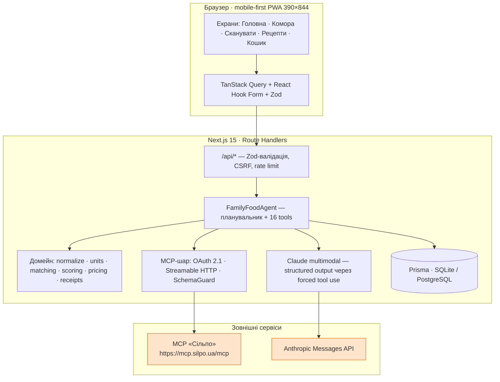
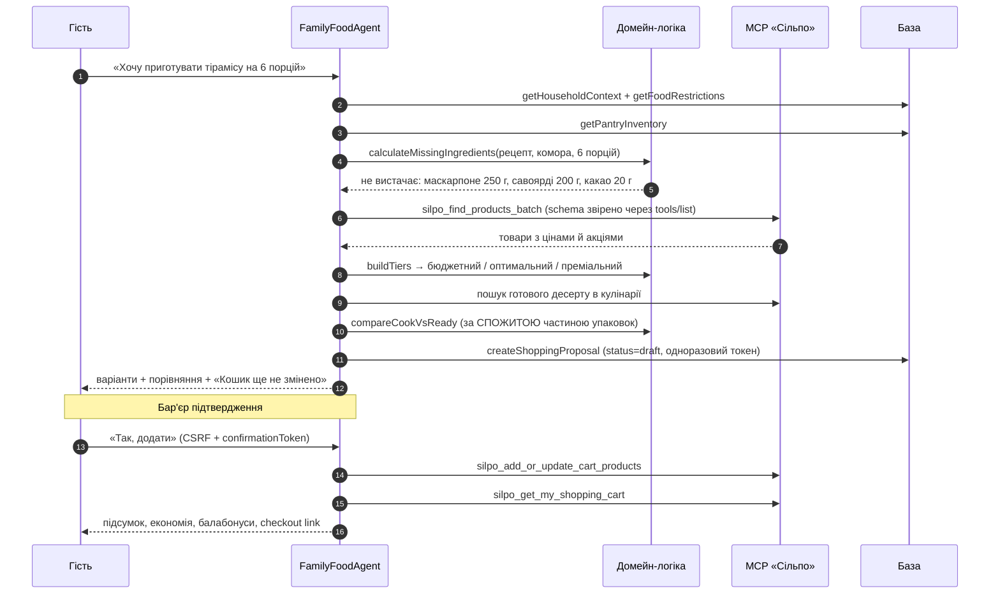
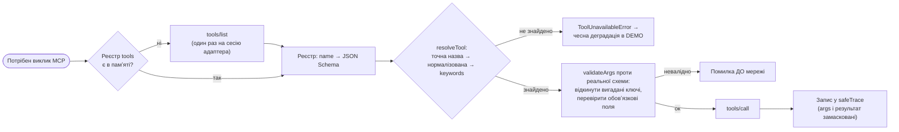
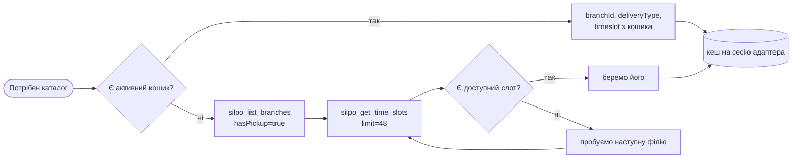
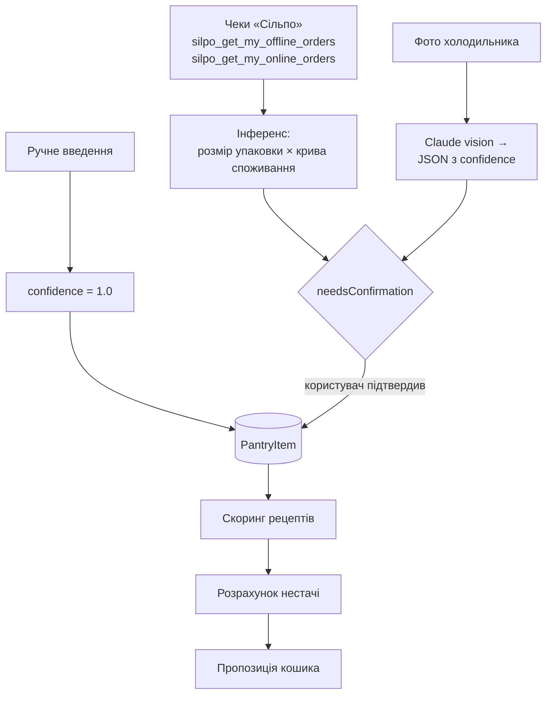
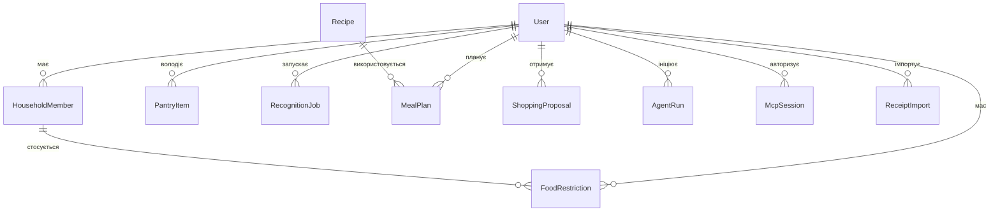

# ARCHITECTURE.md — «Сільпо: Сімейна комора»

## 1. Принцип, з якого все випливає

> Модель робить те, що вона робить добре — бачить фото і розуміє природну мову.
> За гроші, кошик і алергії відповідає детермінований код.

Тому `FamilyFoodAgent` — не «чат із LLM у циклі», а **явний план із типізованих
інструментів**. План можна показати журі, відтворити й перевірити тестами.
LLM викликається рівно в одному місці: розпізнавання продуктів на фото.

## 2. Шари



**Клієнт ніколи не звертається до `mcp.silpo.ua` і ніколи не бачить токен.**
Єдиний шлях назовні — через сервер.

## 3. Головний потік: «Хочу тірамісу»



## 4. MCP-шар: чому саме так

Ми не знаємо наперед точних назв і схем 39 інструментів. Тому:



Це прямо закриває головний ризик інтеграції — «модель вигадала аргумент».
Payload, який не відповідає схемі сервера, не відправляється взагалі.

### Контекст доставки — головне відкриття інтеграції

Каталожні інструменти «Сільпо» не працюють без четвірки
`branchId + deliveryType + timeslotStart + timeslotEnd`; без неї сервер
відповідає `-32602 Input validation error`. Тому перед першим запитом до
каталогу агент виконує bootstrap (`lib/mcp/delivery-context.ts`):



Реальні схеми, зняті з сервера (`npm run mcp:inspect`):

| Інструмент | required |
|---|---|
| `silpo_get_my_profile` / `_family` / `_food_restrictions` / `_loyalty_info` | — |
| `silpo_find_products_batch` | `branchId, deliveryType, timeslotStart, timeslotEnd, products` |
| `silpo_get_product_details` | `branchId, **slug**, deliveryType, timeslotStart, timeslotEnd` |
| `silpo_get_replacements` | `branchId, companyId, productIds, deliveryType` |
| `silpo_get_time_slots` | `branchId` |
| `silpo_add_or_update_cart_products` | `**shoppingCartId**, products` |

Три особливості сервера, які довелось обійти в коді:

1. **Помилки повертаються текстом без `isError`** — `"Error in get-time-slots: API returned 500"`.
   Без явної перевірки нормалізатор перетворив би текст помилки на «порожній кошик».
2. **Параметр `start` у `get_time_slots` дає 500** — тому беремо `limit: 48` і фільтруємо самі.
3. **Транспортні збої** — приблизно один запит із десятка падає з `fetch failed` до відповіді.
   Клієнт ретраїть лише транспортні помилки, ніколи — HTTP-відповіді.

### Перевірені факти про сервер

```
GET /.well-known/oauth-protected-resource/mcp
  → {"resource":"https://mcp.silpo.ua/mcp","authorization_servers":["https://mcp.silpo.ua"]}

GET /.well-known/oauth-authorization-server
  → authorization_endpoint  /authorize
    token_endpoint          /token
    registration_endpoint   /register      ← Dynamic Client Registration є
    code_challenge_methods  ["plain","S256"]  ← використовуємо S256
    grant_types             ["authorization_code","refresh_token"]

POST /mcp без токена → 401 + WWW-Authenticate: Bearer realm="OAuth"
```

Наслідок: `SILPO_CLIENT_ID` у репозиторії не потрібен. Застосунок реєструє себе
сам при першому вході — і вимога «жодних секретів у git» виконується не
дисципліною, а архітектурою.

## 5. Джерела даних комори та їх пріоритет



**Чек — головне джерело**, фото лише уточнює. Це і є відмінність продукту:
комора наповнюється сама, без ручного введення.

Чесність інференсу з чеків:
- кількість = розмір упаковки × «скільки лишилось» за кривою споживання;
- `confidence` падає експоненційно з часом (через тиждень ми майже нічого не знаємо);
- протерміноване **не імпортується взагалі** — краще пропустити, ніж підсунути зіпсоване;
- усі позиції з чеків та фото отримують `needsConfirmation = true`.

## 6. Інструменти агента

| Інструмент | Тип | Джерело даних |
|---|---|---|
| `getHouseholdContext` | read | БД |
| `getFoodRestrictions` | read | БД |
| `analyzePantryPhotos` | read | Claude multimodal |
| `getPantryInventory` | read | БД |
| `updatePantryInventory` | **write** | БД, потребує підтвердження |
| `importPantryFromReceipts` | write | MCP → домейн → БД |
| `findExpiringProducts` | read | домейн |
| `generateRecipeOptions` | read | домейн (скоринг) |
| `calculateMissingIngredients` | read | домейн |
| `searchSilpoProducts` | read | **MCP** |
| `compareProductOptions` | read | домейн + MCP product details |
| `compareCookVsReadyMeal` | read | **MCP** + домейн |
| `createShoppingProposal` | write | БД (лише чернетка) |
| `addConfirmedItemsToCart` | **write** | **MCP**, потребує токен |
| `getCartSummary` | read | **MCP** |
| `recordCookedMeal` | **write** | домейн + БД |

## 7. Скоринг — навмисно прозорий

```
score = pantryCoverage   × 0.30
      + expiryRescue     × 0.25
      + restrictionMatch × 0.20
      + budgetMatch      × 0.10
      + timeMatch        × 0.10
      + preferenceMatch  × 0.05
```

У режимі «використати те, що псується» ваги зміщуються на `expiryRescue = 0.40`.

Алерген — **не доданок, а множник**: `restrictionMatch = 0` обнуляє бал, і страва
взагалі не потрапляє у видачу. Кожен фактор повертає пояснення українською,
і користувач бачить розрахунок по кроках («Чому саме ця страва?»).

## 8. Модель даних



Гроші скрізь у **копійках (ціле число)** — float для валюти не використовується ніде.

Enum-и навмисно не використовуються: SQLite їх не підтримує, а нам потрібен
один файл схеми для локального SQLite і продакшн-PostgreSQL. Перемикач —
`scripts/set-db-provider.mjs` за змінною `DATABASE_PROVIDER`.

## 9. Межі прототипу (сказано прямо)

| Обмеження | Як поводиться застосунок |
|---|---|
| Фото не дає ваги й вмісту закритої упаковки | `confidence` + обовʼязковий екран підтвердження |
| Термін придатності з фото рідко читається | `expiryDateText: null`, а не вигадана дата |
| Чек не знає, скільки вже зʼїли | крива споживання + падіння `confidence` з часом |
| Алергії | страва виключається повністю + вимога перевірити упаковку; медичних гарантій немає |
| Несумісні одиниці (300 мл vs пачка 250 г) | не рахуємо псевдочисло, беремо 1 упаковку |
| Ціле упакування заради 20 г какао | порівняння ведеться за **спожитою** частиною, залишок показуємо окремо |
| Rate limiting у памʼяті процесу | достатньо для прототипу; у продакшні — Redis |
| Demo-кошик у памʼяті процесу | у продакшні кошик і так живе на боці «Сільпо» |
