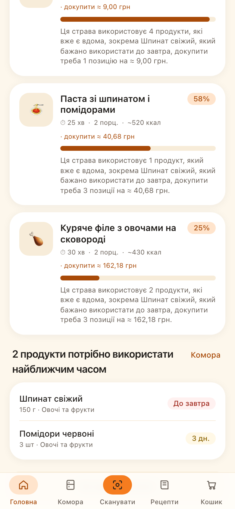
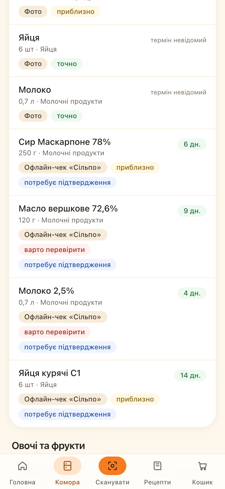
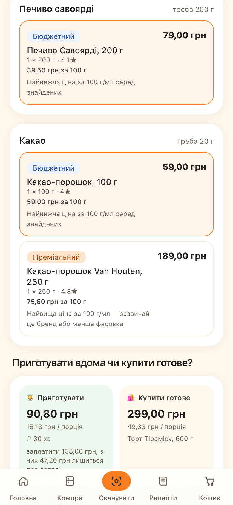
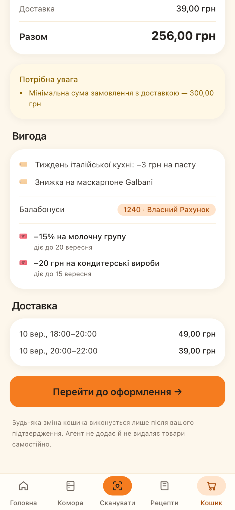

# 🧺 Сільпо: Сімейна комора

> **Hackathon prototype** для «Сільпо» AI Factory.
> Не є офіційним продуктом ТОВ «Сільпо». Усі демонстраційні дані вигадані.

AI-агент, який формує **цифрову сімейну комору** з історії чеків «Сільпо» та
фотографій холодильника, планує раціон з урахуванням складу родини, алергій,
бюджету й термінів придатності, знаходить відсутні інгредієнти в каталозі
через офіційний **MCP «Сільпо»** і — після явного підтвердження — збирає
готовий кошик.

| Головна | Комора | «Хочу тірамісу» | Кошик |
|---|---|---|---|
|  |  |  |  |

---

## Запуск однією командою

```bash
git clone <repo> && cd SilpoPantry && cp .env.example .env && npm install && npm run setup && npm run dev
```

Відкрийте <http://localhost:3210> і натисніть **«Спробувати в демонстраційному режимі»**.
Жодних ключів, токенів чи облікових записів для цього не потрібно.

Мінімальні вимоги: Node.js 20+, npm 10+. База — SQLite, ставиться сама.

### Покроково

```bash
cp .env.example .env      # SESSION_SECRET згенеруйте: node -e "console.log(require('crypto').randomBytes(32).toString('hex'))"
npm install
npm run setup             # prisma generate + db push + seed
npm run dev               # http://localhost:3210
```

### Перевірка якості

```bash
npm run verify            # typecheck + lint + 293 unit-тести
npm run test:e2e          # 13 наскрізних сценаріїв Playwright на 390×844
```

---

## Що працює live, а що в demo mode

Перевірено на живому сервері 06.08.2026 — увесь сценарій «Хочу тірамісу»
пройдено через інтерфейс від запиту до реального кошика:

| Можливість | Live-статус | Примітка |
|---|---|---|
| `tools/list` | ✅ **працює** | 39 інструментів, ~1.8 с |
| Профіль, родина, харчові обмеження | ✅ **працює** | `silpo_get_my_profile` / `_family` / `_food_restrictions` |
| Лояльність, купони, акції | ✅ **працює** | `silpo_get_loyalty_info` |
| Пошук товарів у каталозі | ✅ **працює** | реальні ціни й акції |
| Деталі товару | ✅ **працює** | за `slug`, не за `id` |
| Слоти доставки | ✅ **працює** | 48 слотів, з них ~24 доступні |
| Читання кошика | ✅ **працює** | якщо кошика немає — чесно каже про це |
| Запис у кошик | ✅ **працює** | `add_or_update` + `remove`; підтверджено на власному кошику |
| Сценарій «Хочу тірамісу» цілком | ✅ **працює** | 7 кроків агента · 4 live-виклики · 1,9–5,1 с |
| Розпізнавання фото | DEMO без ключа | `ANTHROPIC_API_KEY` у `.env` |
| Комора, рецепти, скоринг, списання, «готувати vs купити» | ✅ завжди | чиста локальна логіка |
| Нарахування призу за рецепт тижня | ❌ **неможливе** | усі лояльнісні інструменти MCP — лише на читання; застосунок формує заявку зі статусом «очікує» |

Без входу через «Сільпо» все перелічене працює на seed-даних із бейджем `DEMO MODE`.

Режим ніколи не приховується: на кожному екрані стоїть бейдж
`DEMO MODE` або `LIVE MCP`, а `/trace` показує причину вибору режиму текстом.
**Демо-дані ніде не видаються за реальні.**

### Як отримати живий MCP-виклик

1. `npm run dev`
2. Відкрийте `/trace` → **«Увійти через «Сільпо»»**
3. Пройдіть авторизацію в браузері (OAuth 2.1 Authorization Code + PKCE, S256)
4. Поверніться на `/trace` → **«Виконати tools/list на MCP «Сільпо»»**

Застосунок реєструє себе через **Dynamic Client Registration**
(`POST https://mcp.silpo.ua/register`), тому `SILPO_CLIENT_ID` у репозиторії
не потрібен — і його там немає.

### Діагностика MCP

```bash
npm run mcp:probe        # discovery без токена — працює завжди
npm run mcp:inspect      # схеми ключових інструментів (потрібен вхід)
npm run mcp:inspect -- --call   # + read-only виклики
npm run mcp:e2e          # наскрізна перевірка адаптера
npm run mcp:cart         # читання реального кошика
npm run mcp:cart-write   # ОБОРОТНИЙ тест запису: додати → перевірити → прибрати
```

`mcp:cart-write` змінює справжній кошик і одразу повертає його до
початкового стану. Решта команд — тільки читання.

### Особливості живого MCP, які варто знати

| Спостереження | Наслідок для коду |
|---|---|
| `get_my_shopping_cart` віддає лише `shoppingCartId`, без вмісту | потрібен другий крок `get_shopping_cart_by_id` |
| Товари лежать у `cart.shipments[].products[]` | доставка ділиться на відправлення з різних філій |
| Каталог **не повертає ваги упаковки** — лише `weighted` і `step` | вагу дістаємо з назви, інакше показуємо «1 упаковка» |
| Запис у кошик вимагає `productId + companyId + branchId + quantity` | ці поля їдуть із товаром від самого пошуку |
| Пошук працює за точною фразою | «тірамісу» → 5 товарів, «тірамісу готовий десерт» → 0 |
| Транзитні 502 від шлюзу | ретрай на 502/503/504 + мʼяка деградація екранів |

---

## Основні екрани

| Маршрут | Що показує |
|---|---|
| `/login` | Вхід через «Сільпо» + прозорий перелік даних, які використовуються |
| `/onboarding` | Родина, алергії, бюджет; попередньо заповнюється з профілю «Сільпо» |
| `/` | Головна: що приготувати сьогодні і що псується — свідомо лише два блоки |
| `/scan` | Фото → AI-розпізнавання → **обовʼязкове** підтвердження; сканування штрихкоду |
| `/pantry` | Комора за місцями зберігання, джерелом і рівнем упевненості; на скільки вистачить продуктів і яких базових бракує |
| `/recipes` | Підбір страв із прозорим скорингом (розкривається по кроках); 42 рецепти зі 122 порадами, усі прийоми їжі |
| `/plan` | Раціон на 1–14 днів: розклад по днях, один зведений список покупок |
| `/recipes/[slug]` | Рецепт, таймери, заміни, «Я це приготував» зі списанням |
| `/dish?query=…` | Сценарій «Хочу тірамісу»: 3 цінові рівні + «готувати vs купити» |
| `/cart` | Кошик із керуванням кількістю, персональні акції, балабонуси, купони, доставка, checkout link |
| `/recipes/community` | Рецепти від інших родин, голосування за рецепт тижня, приз переможцю |
| `/recipes/new` | Публікація власного рецепта з декларацією алергенів; автоперевірка перед публікацією (незаявлений алерген, контакти, порожні кроки) |
| `/metrics` | «Що змінилось»: частка страв із наявного, спожито вчасно проти викинутого, конверсія поради в кошик — рахуються з подій, мовчать поки подій замало |
| `/trace` | Технічний розріз для журі: інструменти, план, живий MCP-виклик; вихід, відвʼязка «Сільпо», видалення акаунта |

---

## Рецепти спільноти й приз за рецепт тижня

Родини публікують власні рецепти, голосують раз на тиждень і бачать переможця.
Дві речі тут зроблені інакше, ніж проситься на перший погляд.

**Алергени декларує автор, а не вгадує код.** Інгредієнт користувацького рецепта
приходить вільним текстом, і нормалізатор помиляється двома способами — обидва
зафіксовані тестами в `tests/user-recipes.test.ts`:

| Введено | Нормалізовано | Наслідок |
|---|---|---|
| «Арахісова паста» | `арахісова` — невідомий ключ | алергія на арахіс **не спрацює** |
| «Молочко кокосове» | `молоко` | підміна продукту, фільтр помиляється **в обидва боки** |

Тому автор обирає алергени зі закритого списку, а рецепт із нерозпізнаним
інгредієнтом позначається неперевіреним: він видимий у стрічці, але агент не
бере його в раціон — зіставити склад із коморою й обмеженнями родини він не може.
Мовчазна впевненість тут коштувала б чужого здоровʼя.

**Приз названо тим, чим він є.** Переможець отримує заявку на 500 балабонусів
від «Сільпо» зі статусом «очікує нарахування». Застосунок не нараховує їх сам:
серед 39 інструментів MCP усі лояльнісні працюють лише на читання. Показати
приз, якого ніхто не нарахує, гірше, ніж не мати призу взагалі.

Нагорода створюється **тільки для завершеного тижня** — інакше лідера у вівторок
було б названо переможцем, а під кінець тижня зʼявився б сенс накручувати голоси.

---

## Безпека

- Токени «Сільпо» — **тільки на сервері** (таблиця `McpSession`), у браузер не потрапляють.
- Сесія — підписана HMAC httpOnly + secure + SameSite cookie з одним лише `userId`.
- CSRF — double submit; усі мутуючі маршрути перевіряють заголовок `x-csrf-token`.
- Rate limiting на всіх write-маршрутах, окремий жорсткіший ліміт на розпізнавання фото.
- Фото: перевірка сигнатури файлу, ліміт розміру, **видалення EXIF/GPS до аналізу**,
  жодного збереження на диск, TTL на записи про розпізнавання, можливість видалити історію.
- PII (токени, телефони, email, адреси, зайві id) маскуються перед логом і перед agent trace.
- **Кожна** зміна кошика вимагає CSRF + одноразовий `confirmationToken` пропозиції.
- У репозиторії немає секретів: `.env` у `.gitignore`, `client_id` отримується через DCR.
- У продакшні застосунок **відмовляється стартувати** без `SESSION_SECRET`: підписувати
  сесії відомим із коду ключем гірше, ніж не запуститись.
- Користувач будь-коли може вийти, **відвʼязати «Сільпо» зі збереженням своїх даних**
  або видалити акаунт цілком — усе з екрана `/trace`.

---

## Документація

- [PLAN.md](PLAN.md) — план реалізації та перевірені факти про MCP
- [ARCHITECTURE.md](ARCHITECTURE.md) — шари, потоки даних, Mermaid-діаграми
- [SUBMISSION.md](SUBMISSION.md) — бізнес-цінність, метрики, пілот
- [DEMO_SCRIPT.md](DEMO_SCRIPT.md) — сценарій відеопітчу на 3–5 хвилин

## Авторство, ліцензія та бренд

**Автор:** redpage1989 · Copyright © 2026 · [LICENSE](LICENSE)

Код опубліковано для участі в конкурсі та оцінювання журі. Читати, запускати
локально й цитувати з посиланням — можна вільно. Використання коду у власних
продуктах, поширення копій і похідні роботи потребують письмової згоди автора.

Офіційні логотипи, шрифти й графіка «Сільпо» **не включені** й ліцензією не
покриваються. Уся айдентика на екранах власна: назва «Сімейна комора», палітра
й іконки зроблені для цього прототипу; заява про це є в застосунку на екрані
`/trace`. Застосунок не є офіційним продуктом ТОВ «Сільпо», демонстраційні
дані вигадані.

### Чим підтверджується авторство

Історія Git — основний доказ: кожен коміт має автора, час і повний зміст змін.
Копію без цієї історії неможливо видати за первинну, а з нею — видно, що вона
похідна. Для сторонньої фіксації дати варто опублікувати репозиторій на GitHub
і поставити підписаний тег на версію, подану на конкурс:

```bash
git tag -s v1.0-submission -m "Версія, подана на «Сільпо» AI Factory"
```

Ідея продукту, за умовами конкурсу, конфіденційною не вважається — захищене
саме втілення: код, тексти, структура даних і документація.
